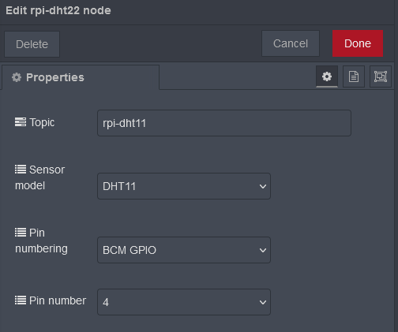
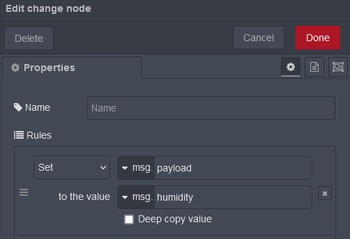
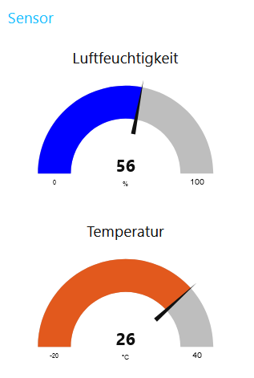

---
# https://iotstarters.com/building-node-red-dashboard-with-dht11-sensor/
layout: default
title: DHT11
nav_order: 4
---

#  DHT11

Diese Software-Dokumentation beschreibt, wie der DHT11-Temperatursensor an einen Raspberry Pi angeschlossen und verwendet werden kann, um die Temperatur zu messen. Der DHT11 ist ein kostengünstiger und weit verbreiteter Sensor, der sowohl die Temperatur als auch die Luftfeuchtigkeit messen kann.

## Anschließen an den RPi

Führen Sie die folgenden Schritte aus, um den DHT11-Sensor mit dem Raspberry Pi zu verbinden:
 

1. Stecken Sie den DHT11-Sensor in das Steckbrett (Breadboard).
     
2. Verbinden Sie den 5V-Pin des Raspberry Pi mit dem VCC-Pin des DHT11-Sensors.
     
3. Verbinden Sie den GPIO-Pin 4 des Raspberry Pi mit dem DATA-Pin des DHT11-Sensors.
     
4. Verbinden Sie den GND-Pin des Raspberry Pi mit dem GND-Pin des DHT11-Sensors.
    

## Konfiguration in Node-RED

Um den DHT11 in NodeRED nutzen zu können müssen Sie das Plugin "node-red-contrib-dht-sensor" verwenden. Um dieses zu installieren öffnen Sie Ihren Webbrowser und navigieren Sie zu http://IP-des-Raspberry:1880. Sie sollten die Node-RED-Benutzeroberfläche sehen. Klicken Sie auf das Menü-Symbol in der oberen rechten Ecke und wählen Sie "Manage Palette" aus dem Dropdown-Menü.Navigieren Sie zum Tab "Install" und suchen Sie nach dem Plugin. Klicken Sie auf die Schaltfläche "Install" neben dem Dashboard-Plugin, um es in Node-RED zu aktivieren.

Um nun die Daten vom DHT11 zu bekommen wir eine inject-Node und eine rpi-dht22-Node benötigt. In der inject-Node wird eingestellt wie oft die Daten des Sensors gelesen werden sollen (z.B. einmal pro Sekunde). Die andere Node wird wie folgt eingestellt um auf den Sensor zuzugreifen:

Danach wird automatisch die aktuelle Temperatur in `msg.payload` und die Luftfeuchtigkeit in `msg.humidity` geschrieben.

## Anzeige im Dashboard

Um die Daten im Dashboard anzuzeigen werden am besten zwei Gauge-Nodes verwendet. Diese zeigen den Wert aus `msg.payload` an, deswegen muss für die Temperaturanzeige hier nichts mehr an den Daten geändert werden und für die Luftfeuchtigkeit lediglich `msg.payload` auf `msg.humidity` gesetzt werden, dies geht einfach mit einer change-Node.

In den Gauge-Nodes selbst muss nur eine beliebige Gruppe festgelegt werden und es kann nach belieben die genaue Darstellung angepasst werden. Zu empfehlen ist hier `Label`, `Units` und `Range` passend einzustellen.

Der komplette Flow und die Anzeige im Dashboard sehen dann wie folgt aus:

 
